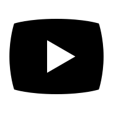
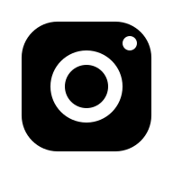

# 🚀 Piano di Ottimizzazione Completa

## Stato Attuale
- ✅ **food.html**: Ottimizzata (meta tags, ARIA, preconnect, WhatsApp)
- ⚠️ **Altre 13 pagine**: Da ottimizzare

## Ottimizzazioni da Applicare

### 1. HEAD Standardizzato
- [x] Meta charset, viewport
- [x] Meta description, keywords, author
- [x] Open Graph tags
- [x] Twitter Card
- [x] Favicon
- [x] Preconnect per Google Fonts
- [x] Font unificato (un solo link invece di due)
- [x] CSS

### 2. HEADER Standardizzato
- [x] role="banner"
- [x] aria-label su link logo
- [x] role="navigation" + aria-label
- [x] aria-label su ogni link menu

### 3. FOOTER Standardizzato
- [x] role="contentinfo"
- [x] <address> per contatti
- [x] Social: WhatsApp, YouTube, Instagram (NO LinkedIn)
- [x] rel="noopener noreferrer"
- [x] aria-label su social
- [x] loading="lazy" su immagini

### 4. MAIN
- [x] role="main"
- [x] aria-labelledby su sezioni

### 5. CSS
- [x] Verificare duplicati
- [x] Minimizzare se possibile

### 6. JS
- [x] Verificare performance
- [x] Già ottimizzato ✅

## Pagine da Ottimizzare (in ordine di priorità)

1. ✅ food.html - COMPLETATA
2. index.html - Parzialmente ottimizzata
3. Lavori.html
4. Contatti.html
5. Profilo.html
6. Foto.html
7. Video.html
8. Musicali.html
9. editoriali.html
10. Locali.html
11. Analogie.html
12. iomedio.html
13. lealea.html
14. lovepatrol.html

## Template HEAD Standard

```html
<!-- Meta Tags Essenziali -->
<meta charset="utf-8">
<meta name="viewport" content="width=device-width, initial-scale=1.0">
<meta http-equiv="X-UA-Compatible" content="IE=edge">

<!-- SEO Meta Tags -->
<meta name="description" content="...">
<meta name="keywords" content="...">
<meta name="author" content="Sebastiano La Rosa">

<!-- Open Graph / Facebook -->
<meta property="og:type" content="website">
<meta property="og:title" content="...">
<meta property="og:description" content="...">
<meta property="og:image" content="...">
<meta property="og:url" content="...">

<!-- Twitter Card -->
<meta name="twitter:card" content="summary_large_image">
<meta name="twitter:title" content="...">
<meta name="twitter:description" content="...">
<meta name="twitter:image" content="...">

<!-- Favicon -->
<link rel="icon" type="image/png" href="img/ph/bianco.png">

<!-- Preconnect per Font Google -->
<link rel="preconnect" href="https://fonts.googleapis.com">
<link rel="preconnect" href="https://fonts.gstatic.com" crossorigin>

<!-- Font -->
<link href="https://fonts.googleapis.com/css2?family=Oswald:wght@200..700&family=Montserrat:ital,wght@0,100..900;1,100..900&display=swap" rel="stylesheet">

<!-- Stylesheet -->
<link rel="stylesheet" type="text/css" href="stile.css">
```

## Template FOOTER Standard

```html
<footer role="contentinfo">
    <div class="footer-content">
        <address class="contact-info">
            <p><strong>Sebastiano La Rosa</strong></p>
            <p>
                <a href="mailto:sebisorbll@gmail.com" id="emailLink" title="Clicca per inviare email">sebisorbll@gmail.com</a>
            </p>
            <p>@sebisorb</p>
        </address>

        <div class="social-icons" role="navigation" aria-label="Link social media">
            <a href="https://wa.me/393472146153?text=Ciao%20Sebastiano" target="_blank" rel="noopener noreferrer" aria-label="Scrivimi su WhatsApp">
                
            </a>
            <a href="https://www.youtube.com/channel/UC5YKIzqmDr_mJyhiih4DOiA" target="_blank" rel="noopener noreferrer" aria-label="Visita il canale YouTube">
                
            </a>
            <a href="https://www.instagram.com/sebisorb/" target="_blank" rel="noopener noreferrer" aria-label="Visita il profilo Instagram">
                
            </a>
        </div>
    </div>
</footer>
```
